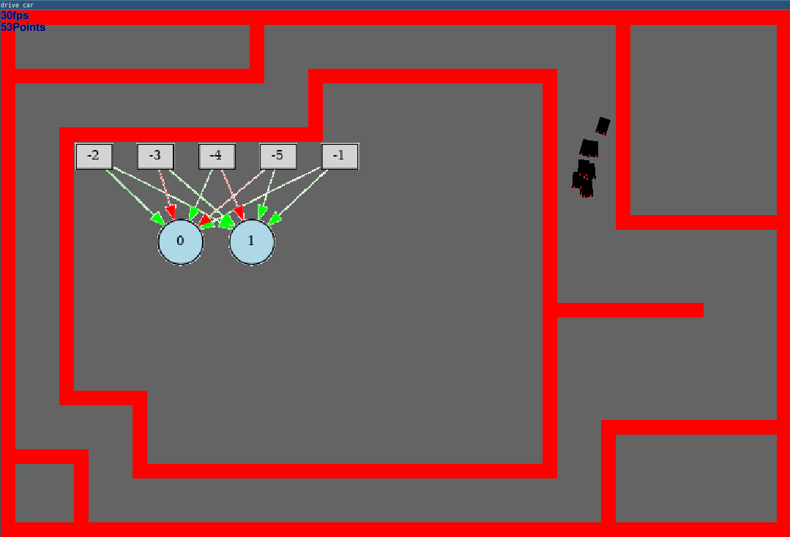

# Drive Car!
A simple self-learning game example using the python neat library
### Installation:
Automated:
```
git clone git@github.com:Greyhash-dev/Drive-Car.git
cd Drive-Car/
chmod +x install.sh
./install.sh
python3 main.py
```
Manual (if you have installed "python3"):
```
git clone git@github.com:Greyhash-dev/Drive-Car.git
cd Drive-Car/
sudo pip3 install -r requirements.txt
sudo apt-get install graphviz
python3 main.py
```
Manual (if you have installed "python-is-python3"):
```
git clone git@github.com:Greyhash-dev/Drive-Car.git
cd Drive-Car/
sudo pip install -r requirements.txt
sudo apt-get install graphviz
python main.py
```
## The Project:
 <br>
This is my first Project with AI, I hope you like it!

### Map Edit shortcuts:
ESC - Exit **WITHOUT** saving <br>
E - Exit with saving <br>
F - Fill only <br>
D - Clear only <br>
R - Range select <br>
C - Clear everything <br>

### Debugging:
For the Error 'AttributeError: module 'neat' has no attribute 'config'':
```
pip3 uninstall neat
sudo pip3 install neat-python 
```
